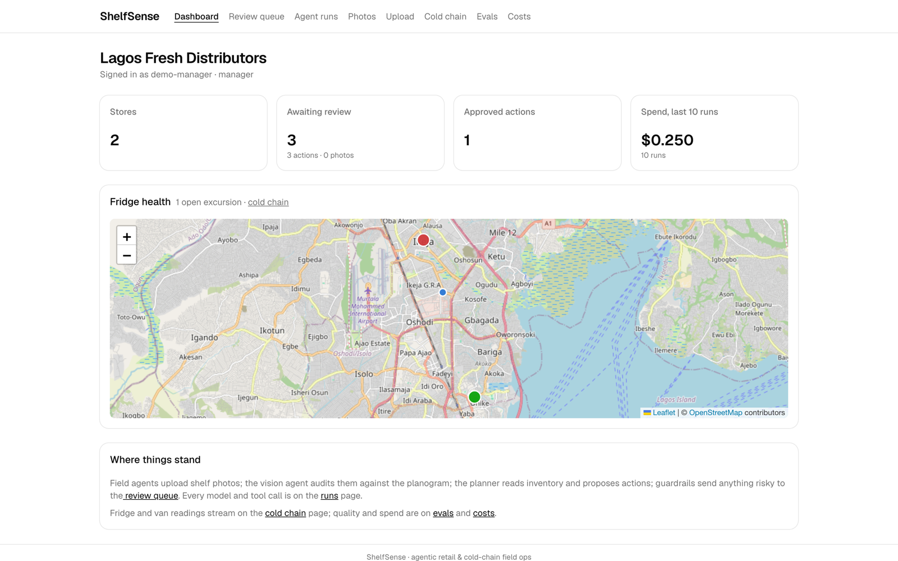
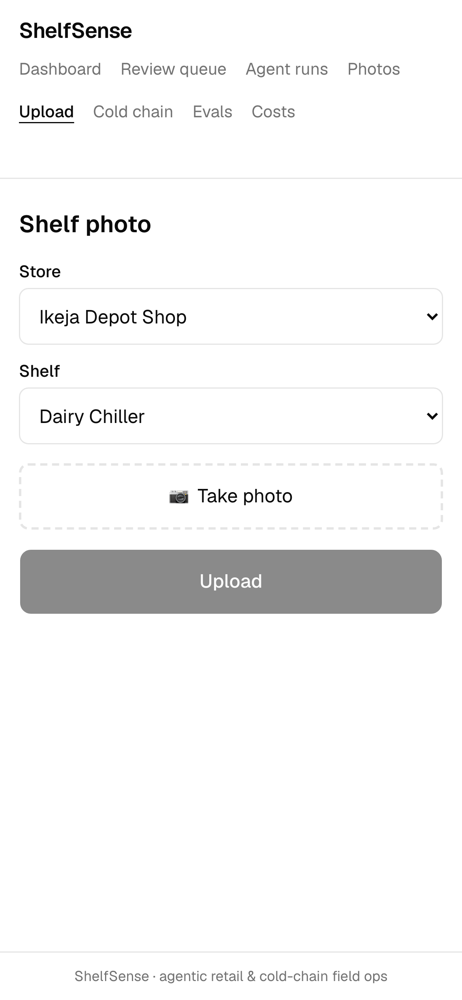
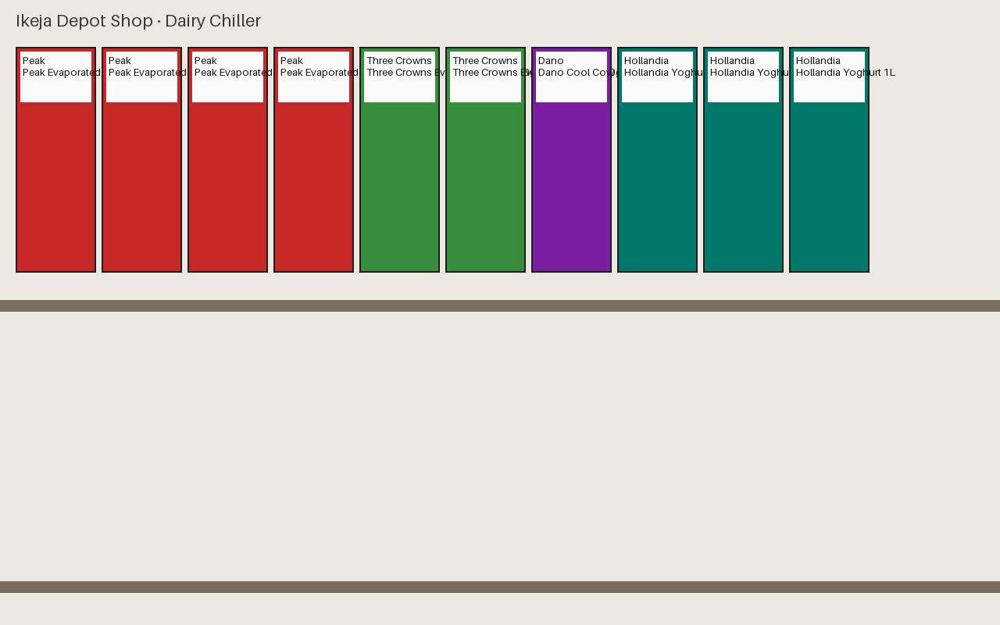
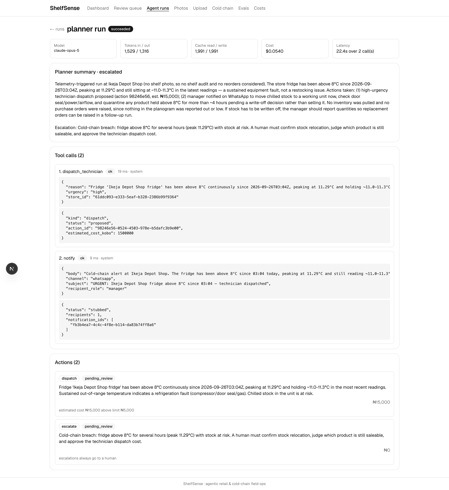
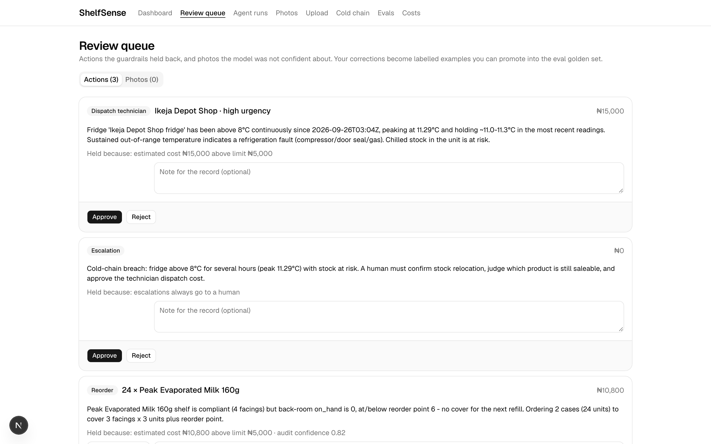
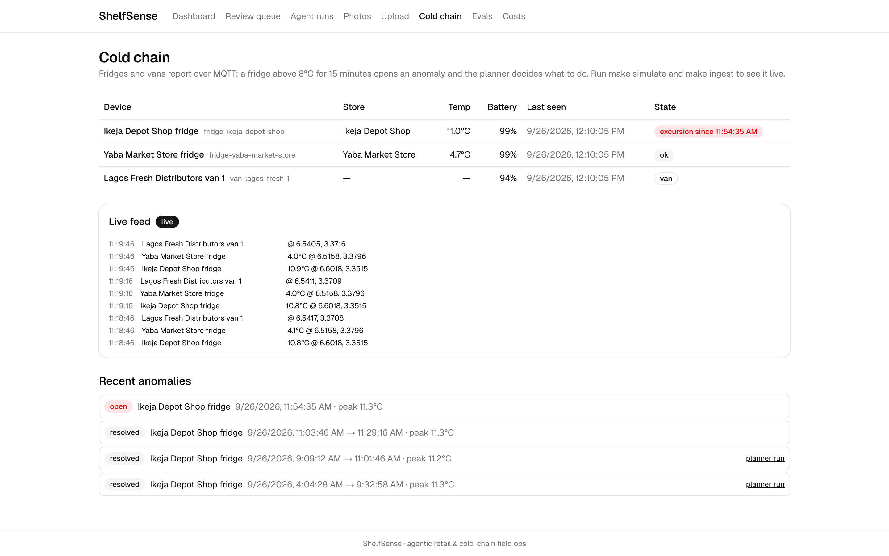
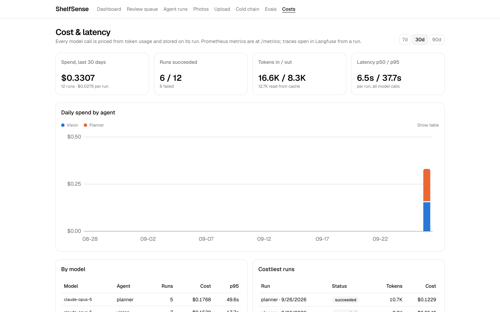
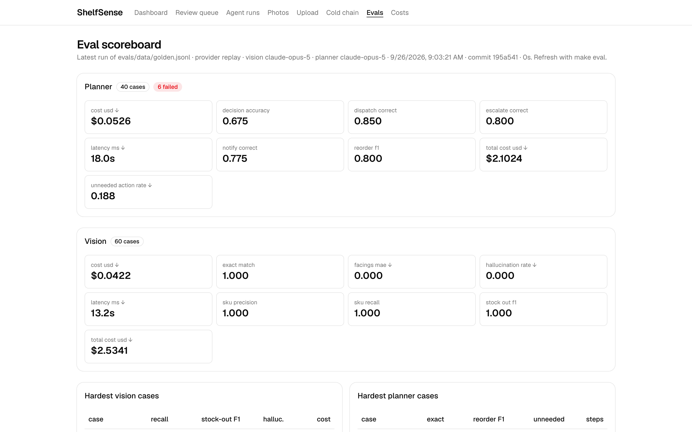

# ShelfSense

**Photograph a shop shelf. ShelfSense spots what is missing, drafts the reorder, and asks a
person before any money is spent. It also watches the fridges.**



## The problem

Small distributors in Lagos supply hundreds of corner shops with milk, noodles, drinks and
soap. To know what is on each shelf, a field agent takes a photo and sends it over WhatsApp,
and someone in the office types what they see into a spreadsheet. Orders are late, gaps on
the shelf go unnoticed for days, and nobody notices a chiller that has quietly warmed up
overnight until the stock inside has spoiled.

ShelfSense reads the photo for you, checks the fridge readings for you, and writes up what
should happen next. A person still makes the call.

## Who it is for

- **The field agent**, who takes one photo per shelf on a phone and is done.
- **The shop or operations manager**, who approves, changes or rejects what the system
  proposes, from a single queue.
- **The distributor's owner**, who wants to see fridge health, pending decisions and what
  the AI is costing, on one page.

## One day at Ikeja Depot Shop

The demo data follows a distributor called Lagos Fresh with two shops. Here is what one day
looks like.

**9:05 — Ada photographs the dairy chiller.**
She picks the store and the shelf on her phone and taps upload. That is her whole job.

<p>

&nbsp;&nbsp;

</p>

_The shelf on the right is a computer-rendered test shelf, not a real photo. Real photos
work the same way; see "What it does not do yet"._

**9:06 — ShelfSense reads the photo.**
It compares what it sees with the plan for that shelf (which product belongs in which slot).
Two of the six slots are empty: Peak powdered milk and Cowbell milk sachets. It says how
confident it is (82 %), so a shaky reading gets a second look from a person.

**9:06 — It checks the stock room and drafts the orders.**
The powdered milk is only missing from the shelf, there is more in the back room, so it
just asks for a refill. The evaporated milk still looks fine on the shelf but the back room
is empty, so it drafts an order for two cases, about ₦10,800, and writes a short note saying
why.



**9:07 — The order waits for a manager.**
₦10,800 is above the ₦5,000 that the system may approve on its own, so the order sits in the
review queue. The manager can approve it, change the quantity first, or reject it. Whatever
they decide is stamped with their name.



**14:30 — The chiller at Ikeja warms up.**
Every fridge reports its temperature every few seconds. When one stays above 8 °C for
15 minutes, an alert opens, ShelfSense proposes sending a technician (held for approval,
since a call-out costs about ₦15,000) and messages the manager to move the chilled stock. On
the map, the store turns red.



**End of day — every decision has a price tag.**
Each time the AI reads a photo or plans an action, the cost is recorded next to the result.
Reading one shelf costs about four US cents.



**Nothing is spent, dispatched or sent without a person saying yes.**

## What it does not do yet

- It has not been put on the public internet. Everything runs on a laptop today; the steps
  to deploy it are written down but have not been carried out.
- It has been tested on rendered shelves, not on real photos. Real photos will be harder,
  and the workflow for adding them is ready.
- The WhatsApp and email messages it drafts are recorded, not sent. No messaging provider
  is connected.
- The map uses free OpenStreetMap tiles, which are fine for a demo and not for a product.

<details>
<summary><strong>Words used in this project</strong></summary>

- **Planogram**: the plan of which product goes in which slot on a shelf.
- **SKU**: one product line, for example "Peak Powdered Milk 400 g".
- **Facings**: how many units of a product are visible from the front of the shelf.
- **Stock-out**: a slot that should have a product in it and is empty.
- **Telemetry**: the readings a fridge or van sends, such as temperature and location.
- **Cold chain**: keeping chilled goods cold all the way from depot to shelf.
- **Agent**: a program that decides a next step, uses a tool, reads the result, and repeats.
- **Guardrail**: a rule that stops the agent acting alone, such as a spending limit.
- **Eval**: a scored set of test cases that the agents are graded against.
- **Tenant**: one customer company. Each tenant's data is walled off from every other.

</details>

## Screens

<table>
  <tr>
    <td><a href="docs/images/dashboard.png"></a><br><sub>Dashboard: stores, pending decisions, spend, fridge map</sub></td>
    <td><a href="docs/images/review-queue.png"></a><br><sub>Review queue: approve, edit or reject what was held</sub></td>
  </tr>
  <tr>
    <td><a href="docs/images/run-planner.png"></a><br><sub>A planner run: reasoning, tool calls, actions, cost</sub></td>
    <td><a href="docs/images/cold-chain.png"></a><br><sub>Cold chain: live readings and open excursions</sub></td>
  </tr>
  <tr>
    <td><a href="docs/images/evals.png"></a><br><sub>Eval scoreboard: how well the agents score on the test set</sub></td>
    <td><a href="docs/images/costs.png"></a><br><sub>Cost and latency per day, per model and per run</sub></td>
  </tr>
</table>

---

## For engineers

**Agentic retail and cold-chain field operations.** Field agents photograph shelves and
fridges stream telemetry; AI agents turn both into decisions (reorder, dispatch, escalate)
behind a human review queue, with production-grade evals in CI and every model call traced
and priced. Built as a flagship portfolio project for AI-engineer and agentic-systems roles.

> Status: **P0–P9 complete.** Deploy configuration is written and documented but the first
> production deploy has not been executed (see _Known limitations_).

The system diagram, the component table, the repository layout, the phase list and the
configuration knobs are in [docs/ARCHITECTURE.md](docs/ARCHITECTURE.md).

### Quickstart

Requirements: Docker, Node 22, pnpm 10, uv (Python 3.12), an Anthropic API key for live
model calls (tests and evals need none).

```sh
make install     # uv sync + pnpm install
make dev         # postgres :5433, redis :6379, s3 :9000, mqtt :1883   (make dev-full adds Langfuse :3001)
make migrate     # alembic upgrade head
make seed        # 2 tenants, 3 stores, 6 shelves, 40 SKUs, planograms, inventory, devices
make api         # FastAPI on :8000        make worker    # agents        make ingest   # MQTT
make web         # Next.js on :3000        make simulate  # fridges + vans at 10x speed
make demo        # queue the synthetic photos and an hour of telemetry with one fridge fault
make verify      # ruff, mypy --strict, pytest, prettier, eslint, tsc, vitest, next build
```

Postgres sits on host port 5433 and Langfuse on 3001 to avoid the usual collisions;
override any port in `.env` (created from `.env.example` on first `make dev`). On macOS,
`/usr/bin/make` may be the Xcode stub: `brew install make` or run the Makefile's commands.

**A first run, end to end**

1. `make demo` queues three synthetic shelf photos and an hour of telemetry.
2. `make process-jobs` (or leave `make worker` running): the vision agent audits each photo
   against its planogram, the planner reads inventory and proposes actions, the fridge
   excursion triggers a technician-dispatch proposal.
3. Open http://localhost:3000. Dev auth mode is on: the control at the top right switches
   tenant and role. **Review queue** holds what the guardrails caught; **Agent runs** shows
   every call; **Costs** shows what it cost.

To try it without spending: `SHELFSENSE_LLM_PROVIDER=replay SHELFSENSE_LLM_FIXTURES_DIR=apps/api/tests/fixtures/llm make process-jobs`
replays the recorded vision responses for the three demo photos. The screenshots above come
from `scripts/capture-screenshots.cjs` run against this local stack.

### Calling the API

```sh
curl -s localhost:8000/v1/stores -H "X-Dev-Tenant: <tenant id from make seed>" -H "X-Dev-Role: manager"
curl -s -X POST localhost:8000/v1/shelves/<shelf id>/photos -H ... -F "file=@shelf.jpg;type=image/jpeg"
curl -s localhost:8000/v1/runs?kind=planner -H ...
curl -s -X POST localhost:8000/v1/actions/<id>/approve -H ... -d '{"quantity": 12}'
curl -s -X POST localhost:8000/v1/telemetry -H ... -d '{"readings": [...]}'
curl -N localhost:8000/v1/runs/stream -H ...              # SSE of run progress
```

The contract is written first in [apps/api/openapi.yaml](apps/api/openapi.yaml); the
generated document and the TypeScript types are checked for drift in CI. Auth modes (dev
headers locally, Clerk JWKS with Organizations in production) are described in
[docs/ARCHITECTURE.md](docs/ARCHITECTURE.md#auth-modes) and set up in
[docs/DEPLOYMENT.md](docs/DEPLOYMENT.md#0-prerequisites).

### Decisions

Every significant choice has an ADR in [docs/decisions/](docs/decisions/) (0001–0010). The
ones most worth reading: [RLS and identity](docs/decisions/0002-tenant-context-and-auth.md),
[the LLM layer and fixtures](docs/decisions/0003-llm-layer-and-jobs.md),
[planner, tools and guardrails](docs/decisions/0004-planner-tools-and-guardrails.md),
[evals](docs/decisions/0007-evals.md).

### Numbers you can check

From [evals/baseline.json](evals/baseline.json), replayed from recorded model responses:

- Vision: 60 synthetic cases, exact match 100 %, hallucination rate 0, mean $0.042 per photo.
- Planner: 40 synthetic cases, decision accuracy 67.5 %, 6 cases unscored (fixtures
  missing), mean $0.053 per run.
- Guardrails ([config.py](apps/api/shelfsense_api/config.py)): auto-approve limit ₦5,000,
  review below 0.7 confidence, excursion at 8 °C for 15 minutes.

### Known limitations

Stated rather than hidden:

- **Not deployed yet.** `fly.toml`, the Dockerfile and `apps/web/vercel.json` are written
  and the image builds; the runbook is [docs/DEPLOYMENT.md](docs/DEPLOYMENT.md). The
  first deploy needs `flyctl`, a Clerk instance with Organizations enabled, and credits.
- **Synthetic evals are easy.** Vision scores 100 % on rendered shelves. Real photos will
  score lower; [evals/README.md](evals/README.md) is the labelling workflow for the 30
  real photos, and their baseline will be gated separately. Six planner fixtures are
  missing because the API account ran out of credits mid-recording; `make eval-record`
  fills them.
- **Planner decision accuracy is 67.5 %** against the written policy on synthetic cases,
  mostly notify/escalate judgement calls. The eval exists to make prompt changes
  measurable; the prompt has not yet been tuned against it.
- **Reasoning streams per turn, not per token.** Structured output and tool decisions need
  the complete response; the run page streams turns and tool results.
- **Notifications are stubs.** `notify` records the message for every user in the target
  role; no WhatsApp or email provider is wired. `geocode` answers only from store records.
- **Anomalies are evaluated on the trailing readings.** A batch that both starts and ends
  an excursion within itself opens nothing; live ingest sees every reading. A per-device
  state row is the next step for a real fleet.
- **Map tiles** come from public OpenStreetMap servers; production needs a tile provider.
- **Bounding boxes are not editable** in the review UI; corrections edit facings per slot.

### Contributing & licence

[CONTRIBUTING.md](CONTRIBUTING.md) · [MIT](LICENSE)
